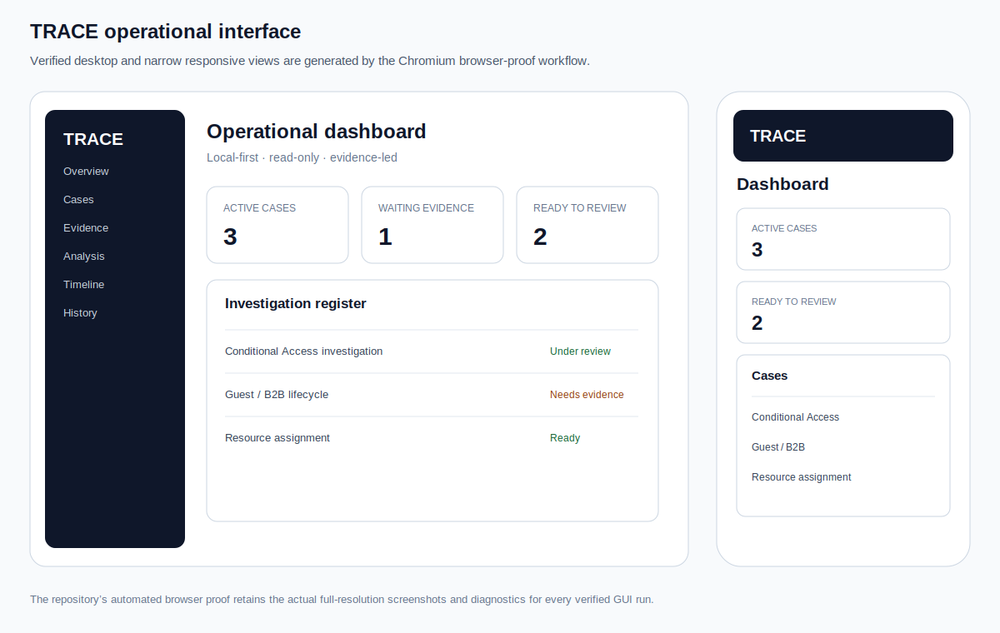

# TRACE IAM Evidence

> [!NOTE]
> **This is the current maintained TRACE repository and the canonical source for the project.**
>
> It supersedes the archived [`trace-ops`](https://github.com/RafaelAlbaWebify/trace-ops) prototype, which is retained only as development history.

TRACE is a **local-first, read-only IAM and access-support investigation workbench**. It turns redacted ticket evidence into structured findings, makes uncertainty visible, records what evidence supports or contradicts a conclusion, and preserves an immutable investigation history for review or escalation.



## Why TRACE exists

Access investigations rarely begin with one complete source. The useful facts may be split across sign-in exports, user reports, invitation state, resource assignments, previous notes and assumptions from different people.

TRACE provides a repeatable support workflow:

```text
create case
  -> collect redacted evidence
  -> record provenance and reliability
  -> run one deterministic scenario analysis
  -> review supporting, contradicting and missing evidence
  -> document safe checks, non-actions and limitations
  -> preserve the immutable run, timeline and report
```

It does not claim a root cause when the available evidence is insufficient.

## Supported investigation scenarios

| Scenario | What TRACE evaluates |
|---|---|
| **Conditional Access** | Documented, redacted Entra sign-in CSV evidence and policy-related signals |
| **Resource assignment** | Whether authentication succeeded but the subject-to-resource assignment is missing or unconfirmed |
| **Guest / B2B lifecycle** | Invitation, redemption, tenant restriction and resource assignment as separate evidence states |

All three scenarios use the same persisted cases, evidence contracts, immutable runs, timeline, reports, archive/reopen behavior and browser acceptance proof.

## Operational interface

The browser application includes:

- workload dashboard and searchable case register;
- case intake, metadata, lifecycle and archive/reopen controls;
- evidence inventory with provenance, reliability and validation state;
- scenario-specific analysis forms;
- structured findings with supporting, contradicting and missing evidence;
- safe next checks, explicit non-actions and limitations;
- append-only investigation timeline and redacted operator notes;
- immutable run comparison and JSON comparison export;
- persisted history and Markdown/JSON report access;
- responsive desktop and narrow layouts.

The CI browser-proof workflow generates and retains the actual full-resolution desktop and narrow screenshots plus console, page-error and responsive diagnostics.

## What the project demonstrates

- Evidence-led Application Support and IAM troubleshooting.
- Shared source-independent investigation and evidence contracts.
- Scenario adapters and deterministic versioned rules.
- Clear separation between fact, inference, contradiction and missing evidence.
- Alembic-managed SQLite persistence and immutable analysis history.
- Support-ready Markdown and JSON exports.
- Self-locating Windows runtime management with verified backup and guarded restore.
- Public-safe portable review packaging with integrity manifest.
- Backend and frontend verification on Ubuntu and Windows.
- Chromium acceptance for every supported scenario and the refurbished GUI.

## Safety boundary

- Local-first and read-only.
- Redacted or public-safe sample evidence only.
- No credentials, tenant-wide scanning or Microsoft Graph connection.
- No automatic access, identity, invitation, policy, licensing or remediation changes.
- No recommendation to disable Conditional Access globally or weaken cross-tenant controls.
- No root-cause claim without sufficient supporting evidence.
- Every finding exposes rule identity, evidence basis, limitations and uncertainty.

Before using TRACE, replace real names, email addresses, tenant IDs, object IDs, tokens and confidential resource names with non-identifying placeholders.

## Quick demonstration

1. Start TRACE locally.
2. Open one of the public-safe default cases or create a new case.
3. Review the evidence inventory and scenario guidance.
4. Run the matching analysis.
5. Inspect the evidence basis, missing evidence, safe checks and non-actions.
6. Add a redacted operator note, compare runs if available and export the report.

See [Setup and three-scenario demo](docs/setup-and-demo.md) for the complete walkthrough.

## Windows local runtime

Prerequisites: PowerShell 7, Python 3.12 and Node.js 22.

Start TRACE from any working directory:

```powershell
pwsh -File C:\path\to\trace-iam-evidence\scripts\trace.ps1 -Action start
```

The UI is available at `http://127.0.0.1:5173`. Runtime data is stored outside the repository under `%LOCALAPPDATA%\TRACE-IAM-Evidence` by default.

Common operations:

```powershell
pwsh -File C:\path\to\trace-iam-evidence\scripts\trace.ps1 -Action status
pwsh -File C:\path\to\trace-iam-evidence\scripts\trace.ps1 -Action diagnostics
pwsh -File C:\path\to\trace-iam-evidence\scripts\trace.ps1 -Action backup
pwsh -File C:\path\to\trace-iam-evidence\scripts\trace.ps1 -Action stop
```

Restore a verified backup only while TRACE is stopped:

```powershell
pwsh -File C:\path\to\trace-iam-evidence\scripts\trace.ps1 -Action restore -RestorePath C:\path\to\backup.db
```

## Portable review ZIP

Create a timestamped, public-safe review archive directly in Downloads:

```powershell
pwsh -File C:\path\to\trace-iam-evidence\scripts\export_portable_review.ps1
```

The exporter does not open Downloads. It includes selected public-safe source, documentation, source/version metadata, diagnostics, scenario and release evidence, review instructions and a SHA-256 manifest. It excludes credentials, local evidence, runtime state, databases, logs, backups, virtual environments, dependency directories and build output.

## Manual development start

```bash
python -m pip install --upgrade pip
python -m pip install -e "backend[dev]"
npm --prefix frontend install --ignore-scripts
```

Run the API:

```bash
python -m uvicorn trace_iam.main:app --host 127.0.0.1 --port 8000
```

Run the frontend in a second terminal:

```bash
npm --prefix frontend run dev -- --host 127.0.0.1 --port 4173
```

Open `http://127.0.0.1:4173`.

## Verification and release proof

The project verifies:

- backend lint, strict type checking and tests on Ubuntu and Windows;
- frontend type checking, tests and production builds on Ubuntu and Windows;
- Windows runtime lifecycle and portable-review safety/integrity;
- Chromium acceptance for all supported investigations;
- desktop and narrow GUI proof with browser diagnostics;
- reproducible public-safe release packs and SHA-256 manifests.

## Documentation

- [Architecture diagram](docs/architecture-diagram.md)
- [Setup and three-scenario demo](docs/setup-and-demo.md)
- [Local runtime and portable review](docs/local-runtime-and-portable-review.md)
- [Known limitations](docs/known-limitations.md)
- [Release notes](CHANGELOG.md)
- [v0.3.0 release draft](docs/releases/v0.3.0.md)

## Development method

No feature is considered complete because code exists. Each milestone is developed in a focused branch, validated through GitHub Actions, inspected at job and artifact level, and merged only after its automatic proof is green.