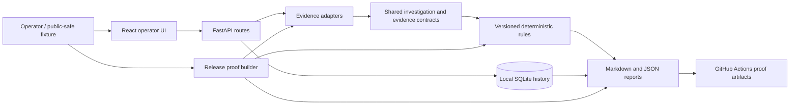

# TRACE architecture

TRACE is a local-first modular monolith. Scenario-specific adapters normalize public-safe evidence into shared domain facts. Deterministic rules produce findings, reports, and immutable local history without connecting to a live tenant.

## Module boundaries

- `domain`: source-independent investigation, evidence, rule, finding, and report contracts.
- `evidence`: Conditional Access, resource-assignment, and guest/B2B input adapters.
- `rules`: scenario-specific deterministic rules implementing the same `Rule` protocol.
- `reporting`: shared Markdown and JSON report generation.
- `persistence`: Alembic-managed SQLite storage and immutable analysis runs.
- `api`: FastAPI workflows and history/export operations.
- `frontend`: React operator workflow and Playwright acceptance proof.
- `release`: reproducible scenario-pack execution and cryptographic manifest generation.

## Trust boundary

TRACE accepts only redacted or public-safe evidence. It does not authenticate to Microsoft Graph, query a tenant, store credentials, modify access, or execute remediation.
